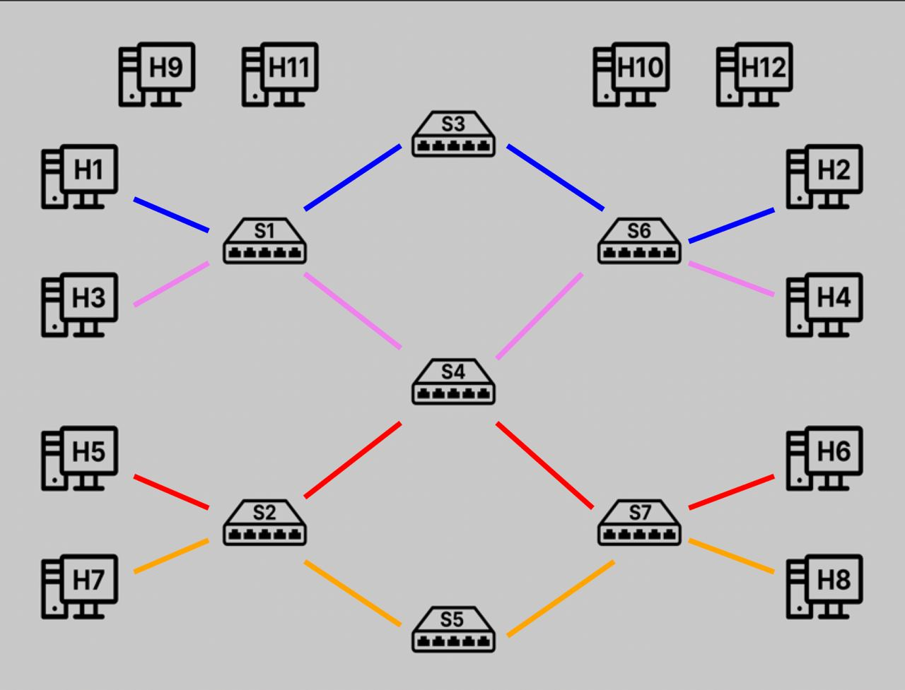
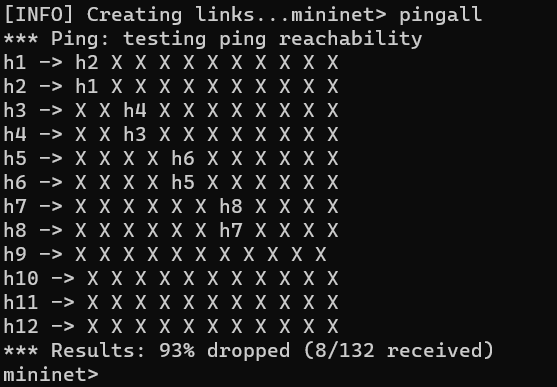
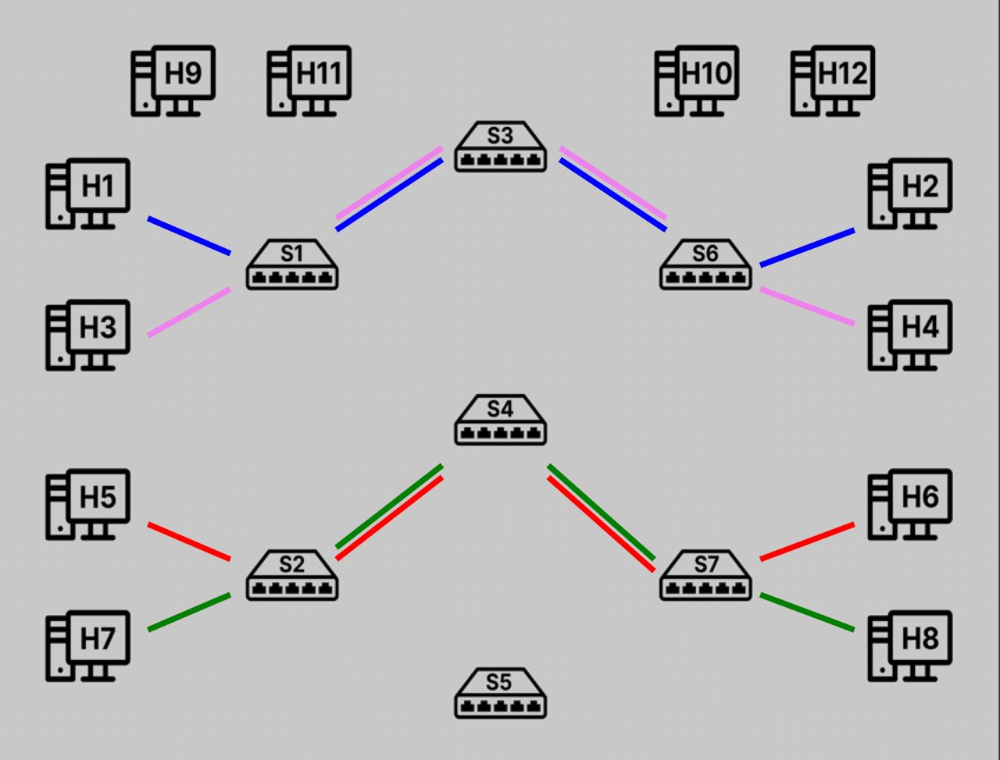
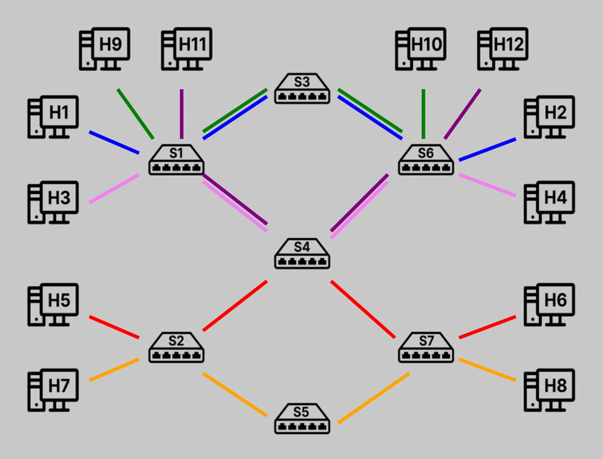
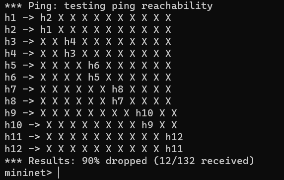
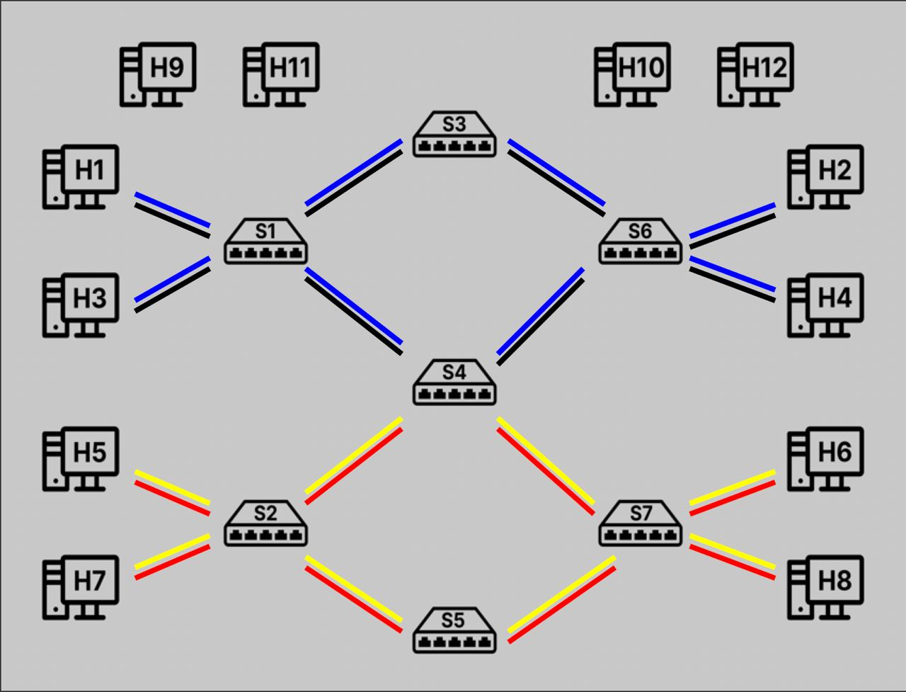
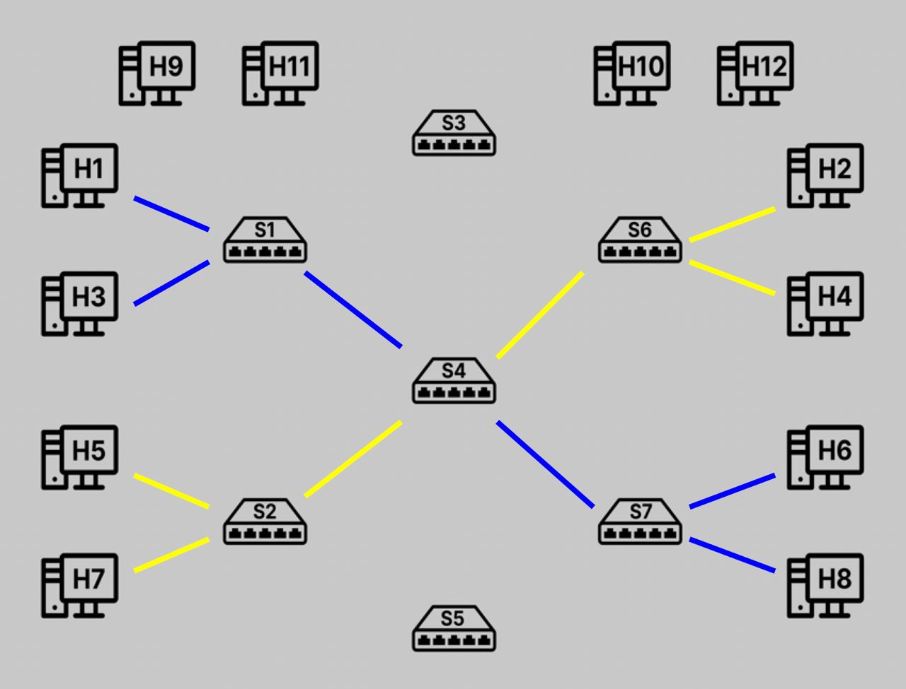
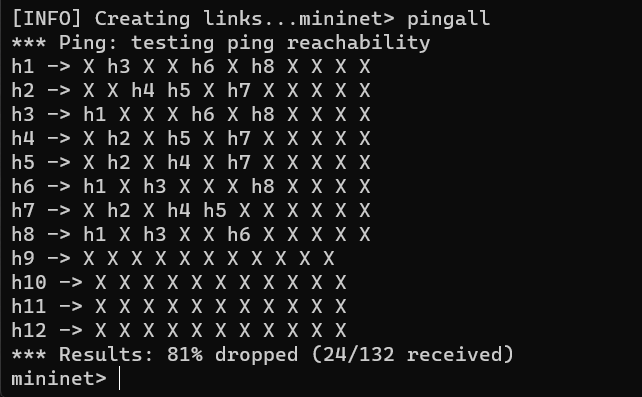

# Networking2
Repository for the Networking2 project

## Introduction
In this project of Softwarize & Virtualized Networks, we will face some use cases of slicing. In particular we will face: 2 examples of events that could destabilize the network and how we can garantee a solid QoS, 1 example of network slicing based on the protocol type (UDP, TCP and ICMP) and 1 more example of communication between two areas of the network. All these examples are built over the same network topology (following image) and can be managed by a dedicated GUI.  


## Default Scenario

The default scenario consists of 7 switches and 12 hosts, 8 of the latter communicate with each other in pairs, through 4 different slices, while the packets sent by the 4 hosts are dropped as soon as they are forwarded. The connection bandwidth is mantained at 10 Mbps
### Pingall



## Scenario 1

In this scenario, we simulate the break of switch 5 and how the network should react to that in order to mantain the QoS. In partcular the traffic is forwarded between switch 3 and 4, with a consequent reduction of the bandwidth to 5 Mbps for the host that pass through switch 3
### Pingall


## Scenario 2

In this scenario, 4 hosts which comunicate in pairs are added to the network, their traffic is forwarded beetween switch 3 and 4; since the new hosts take 3 Mbps the bandwidth of the other host connected to switch 1 and 6 is reduced to 7 Mbps
### Pingall


## Scenario 3

In this scenario, there are four possible slices that can be activated simultaneously:
  - slice1 &#8594; enables UDP communications between h1,h2,h3,h4
  - slice2 &#8594; enables UDP communications between h5,h6,h7,h8
  - slice3 &#8594; enables TCP & ICMP communications between h1,h2,h3,h4
  - slice4 &#8594; enables TCP & ICMP communications between h5,h6,h7,h8

### Pingall

Testing UDP connection:
```
h1 iperf -s -u &
h2 iperf -c 10.0.0.1 -u -t 5 -i 1
```  
Testing TCP connection:  
```
h3 iperf -s &
h4 iperf -c 10.0.0.3 -t 5 -i 1
```  

## Scenario 4

In this scenario we allow many hosts to communicate through the same queues (h1-h3-h6-h8 and h2-h4-h5-h7); switch 3 and 5 are not used
### Pingall


# How To 
## How to Download
1. Go inside  
``` 
.../comnetsemu/app 
```
3. Clone this repository  
``` 
git clone ... 
```
## GUI requirements
1. If you're using multipass or some other VM without graphics interface you need to install a grapichal interface followint this guide: https://multipass.run/docs/set-up-a-graphical-interface
2. make sure to have all the Python3 enviroment installed on your VM
3. run in the terminal ```pip install customtkinter```
4. run in the terminal ```pip install Pillow```
5. run in the terminal ```sudo apt-get install python3-pil python3-pil.imagetk```

## How to Run
1. Open a comnetsemu portale or similar
2. Open the project folder and go into "scripts"
3. Check that the files .sh have the permissions to run, otherwise run this command on all bash files:  
``` 
chmod +x file_name.sh 
```
5. Run the controller:  
``` 
ryu-manager controller.py 
```
6. Run the topology in another terminal:   
``` 
sudo python3 topology.py 
```
7. Use the GUI to interact with the simulated network and change scenario

## How to Stop
1. Stop the Ryu controller
2. Stop mininet and clean the environment 
```
mininet> exit  
$ sudo mn -c
```

