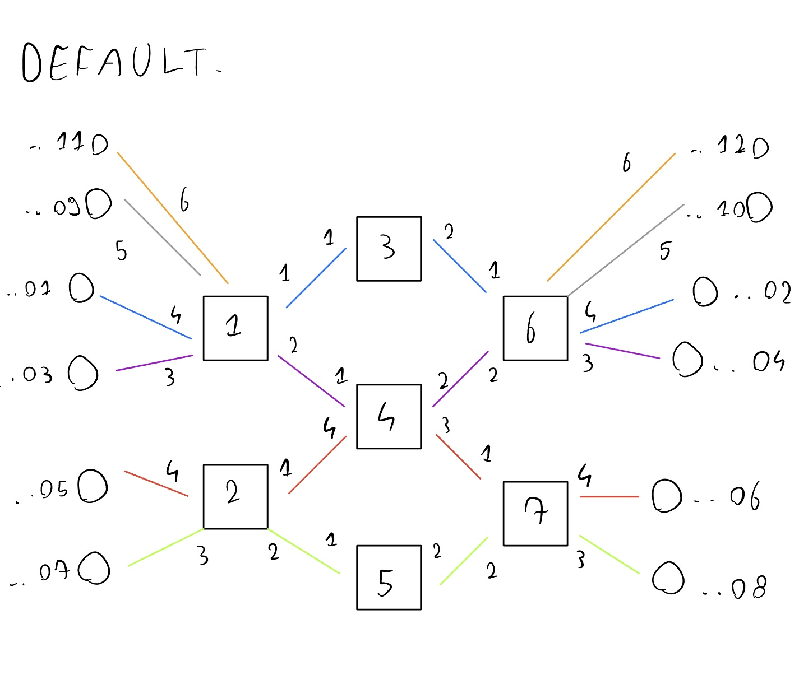
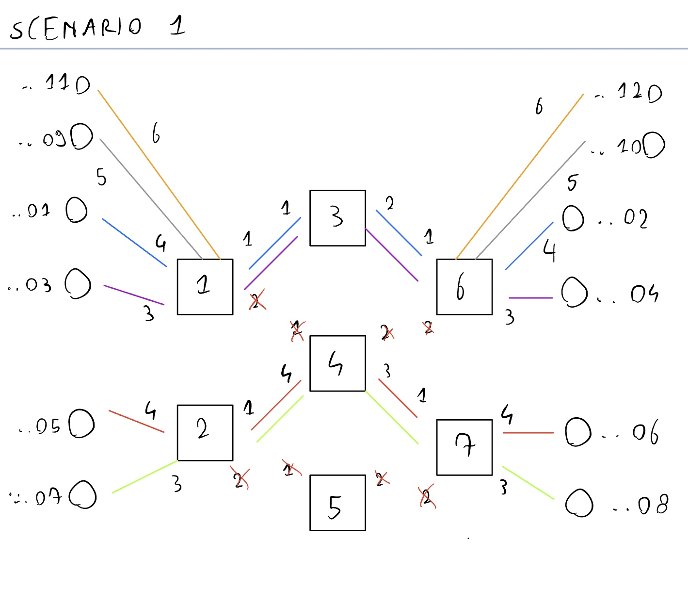
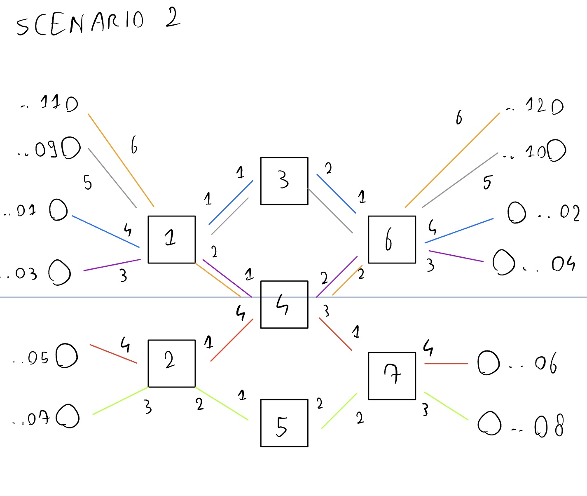
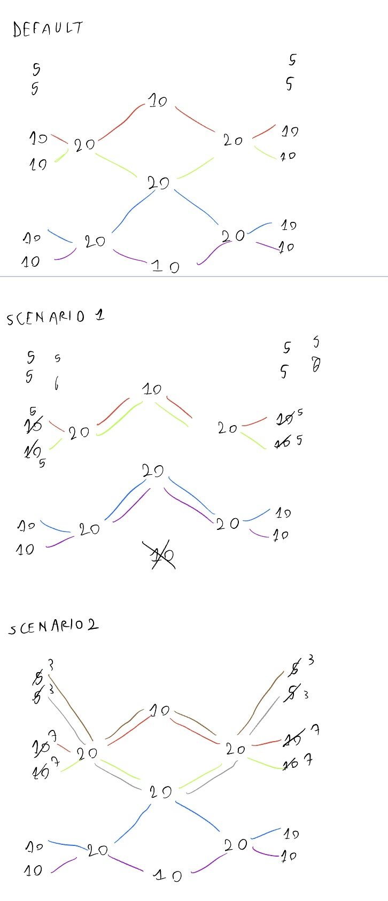

# Networking2
Repository for the Networking2 project

Per provare il progetto:
- clona la repository
- vai nella cartella di riferimento con due terminali
- sudo mn -c
- chmod +x di tutti i file sh
- nel primo terminale ryu-manager controller.py
- nel secondo terminale suo python3 topology.py

Per testare connessione UDP:
h1 iperf -s -u &
h2 iperf -c 10.0.0.1 -u -t 5 -i 1

Per testare connessione UDP:
h3 iperf -s &
h4 iperf -c 10.0.0.3 -t 5 -i 1

Per testare connessione TCP:

Scenario di default:

Scenario 1 con switch 5 rotto:

scenario 2 con 4 host in più collegati:

Queste sono le quatità di banda richieste teoriche (se barrata vuol dire che non riesco ad ottenerla e c'è quella sostitutiva):

